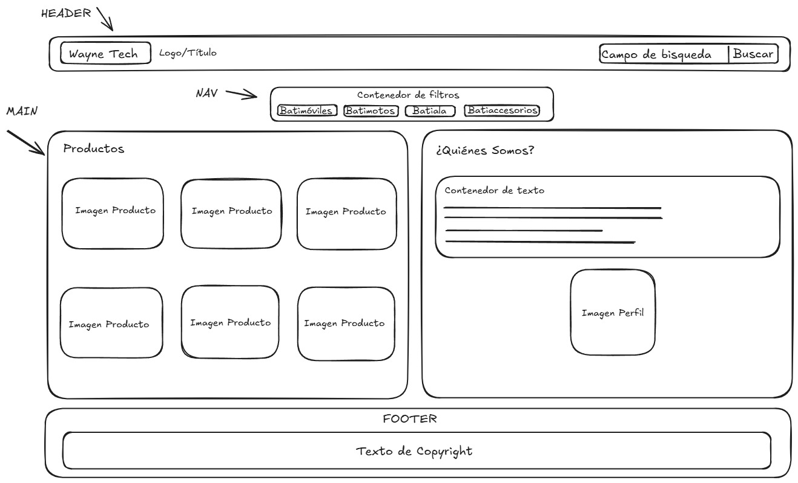

# Wayne Tech

Este taller de tema libre es un trabajo realizado como actividad de evaluación del primer corte del curso de "Desarrollo de FrontEnd" sobre el uso de HTML y CSS. La página presenta una propuesta visual para Wayne Tech, con un catálogo de productos, una sección informativa y un diseño adaptable a diferentes tipos de pantalla.

## Diseño de referencia

La imagen `layout.jpg` fue la base visual utilizada para plantear y organizar este talller. A partir de esta referencia se definieron la distribución general de las secciones, la ubicación del encabezado, el catálogo de productos y un pequeño espacio informativo de la página.

## Tecnologías utilizadas

- HTML para estructurar el contenido de la página.
- CSS para los estilos, la distribución de los elementos y el diseño responsive.

## Uso de Grid y Flexbox

### CSS Grid

Se utilizó **CSS Grid** en los siguientes elementos:

- `.content`: divide el contenido principal en dos columnas, una para los productos y otra para la sección de Quiénes somos?. En pantallas pequeñas cambia a una sola columna para mejorar la lectura.
- `.products-list`: organiza las tarjetas de productos en varias columnas que se ajustan automáticamente según el espacio disponible.

Grid se eligió porque nos permite controlar de forma clara la distribución bidimensional de filas y columnas, facilitando la organización del contenido y su adaptación responsive.

### Flexbox

Se utilizó **Flexbox** en los siguientes elementos:

- `.topbar`: alinea la marca y el formulario de búsqueda en el encabezado, separándolos horizontalmente.
- `.brand`: alinea el logo y el nombre de la empresa.
- `.search`: permite que el campo de búsqueda ocupe el espacio disponible junto al botón.
- `.categories`: centra los enlaces de categorías y permite que pasen a otra línea cuando no hay suficiente espacio.
- `.about-container`: organiza verticalmente el texto y la imagen de la sección informativa.

Flexbox se eligió para alinear elementos en una sola dirección, distribuir el espacio entre ellos y facilitar la adaptación de los componentes en distintos tamaños de pantalla.

## Autores

Gabriela Morales Cancino - T00083372
César Fabricio Salas Ricaurte - T00065846
